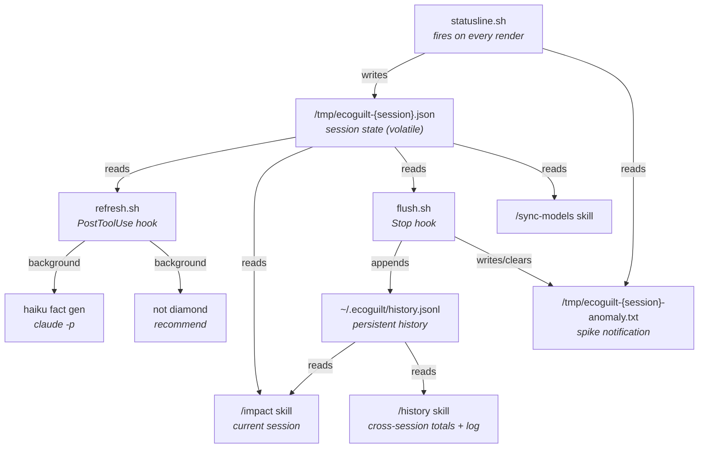

# Ecoguilt

A Claude Code plugin that shows you what your AI coding session is costing the planet.

Every token has a price; in electricity, CO2, and fresh water poured into datacenter cooling systems. Ecoguilt puts the real cost in the status line, the entire time you're working.

## What It Does

**Status line** — Always visible at the bottom of your terminal. Shows session cost, token counts, cache efficiency, context fill, CO₂, a dynamically generated environmental fact, and (with a Not Diamond API key) a model recommendation.

```
$3.90 in:16k out:54k cache:61% ctx:52% · 21.7g CO₂ · this session left a lightbulb on in an empty room for 50 minutes. (nd: opus-4.6 would be more accurate +$2.60)
```

- **`in/out`** — cumulative input and output tokens this session
- **`cache`** — prompt cache efficiency: % of cache activity that was reads (cheap) vs writes (expensive). Higher is better.
- **`ctx`** — how full the context window is
- **`nd:`** — Not Diamond's model recommendation, abbreviated

**`/impact`** — On-demand detailed breakdown for the current session. Tokens, kWh, CO2, water, dollar cost, Not Diamond's verdict, and any anomalous turns detected.

**`/history`** — Cumulative totals across all sessions: today, this week, all time. Session log with per-session metrics. Weekly anomaly summary.

**`/sync-models`** — Refresh the model cache from Not Diamond's API. Run this after editing `models.json`.

## Architecture



- **Status line** (`statusline.sh`) — The only component with access to token counts. Calculates energy incrementally (so model switches don't retroactively recalculate history), writes state, reads cached fact + recommendation, outputs one line. No background jobs.
- **Hook** (`refresh.sh`) — Fires after every tool use. Reads state file, checks thresholds, kicks off Haiku fact generation and Not Diamond recommendation refresh in the background.
- **`/impact` skill** — Reads state file and model cache, presents the detailed bill.
- **`/sync-models` skill** — Fetches pricing from Not Diamond, validates models, builds the cache.

## Install

Clone the repo anywhere:

```bash
git clone https://github.com/huiruru/ecoguilt.git ~/ecoguilt
```

### Step 1: Status line

Add to `~/.claude/settings.json`:

```jsonc
{
  "statusLine": {
    "type": "command",
    "command": "bash ~/ecoguilt/scripts/statusline.sh"
  }
}
```

> Replace `~/ecoguilt` with wherever you cloned the repo. Use absolute paths if `~` doesn't resolve in your shell.

### Step 2: Skills and hooks

Launch Claude Code with the plugin flag:

```bash
claude --plugin-dir ~/ecoguilt
```

This registers the `/impact` and `/sync-models` skills and the PostToolUse hook that refreshes facts and recommendations.

The status line can't be loaded from the plugin manifest (it's a settings-only feature), which is why step 1 is needed separately.

### Verify

The status line appears after ~100 tokens of conversation. Run `/impact` for a detailed breakdown.

## Requirements

- `bash`, `jq`, `curl` — that's it. No Python, no Node, no package managers.
- `claude` CLI — used to generate status line facts via Haiku.
- (Optional) `NOTDIAMOND_API_KEY` — Enables model routing recommendations. Get a key at [notdiamond.ai](https://notdiamond.ai). Without it, you still get the environmental impact numbers, just no "you could be using X instead" comparison.

Set the key in `~/.claude/settings.json`:

```json
{
  "env": {
    "NOTDIAMOND_API_KEY": "sk-..."
  }
}
```

## Adding Models

Edit `models.json` in the plugin root. Each entry just needs an `id` and `provider`:

```json
[
  {"id": "claude-opus-4-6",      "provider": "anthropic"},
  {"id": "gemini-2.5-flash",     "provider": "google"},
  {"id": "gpt-5",                "provider": "openai"}
]
```

Optional `display` field overrides the name shown in the status line:

```json
{"id": "Meta-Llama-3.1-405B-Instruct-Turbo", "provider": "togetherai", "display": "llama-405b"}
```

After editing, run `/sync-models` or:

```bash
bash scripts/sync-models.sh
```

## State & Caching

**Session state** (`/tmp/ecoguilt-{session}.json`) — cumulative metrics for the active session: token counts, energy (kWh), CO2 (g), water (ml), model, cost, cache totals. Written by the status line on every render. Volatile — cleared on reboot.

**Persistent history** (`~/.ecoguilt/history.jsonl`) — append-only JSONL. One record per turn, written by the `Stop` hook via `flush.sh`. Survives reboots. Deduplicated by `(session_id, turn)` at read time — last occurrence wins. Each record includes per-turn deltas and anomaly data alongside session cumulative totals.

**Energy is tracked incrementally.** Each render calculates the delta tokens since the last render and applies the current model's energy rate. This means switching models mid-session (e.g. Opus → Haiku) correctly tracks energy — earlier tokens keep their original model's rate instead of being retroactively recalculated.

**Anomaly detection** runs in `flush.sh` on every Stop hook. Requires ≥3 prior turns to establish a session baseline. Three types:
- **input_spike** — input tokens >3× session average; you sent a large paste or dense prompt
- **output_spike** — output tokens >3× session average; the AI generated a very verbose response
- **cache_break** — cache efficiency dropped >25 points; you're paying full price instead of cached rates
- **cost_spike** — turn cost >3× session average cost per turn

When detected, `flush.sh` writes `/tmp/ecoguilt-{session}-anomaly.txt` so the status line can show `⚠ output_spike` on the next render. Details (including input/output breakdown and efficiency drop) appear in `/impact` and `/history`.

**Background jobs** kick off after tool use (via the PostToolUse hook):
- **Haiku fact** — Regenerates when tokens grow 50% since last generation. Cached until threshold is hit. A single Haiku call costs ~200 tokens (<$0.001), so the overhead is negligible.
- **Not Diamond recommendation** — Refreshes every 5 minutes. Analyzes your transcript to suggest a cheaper model.

**Model cache** (`/tmp/ecoguilt-models.json`) is built once at startup from `models.json` + Not Diamond's API. Run `/sync-models` to refresh after editing `models.json`.

**Cleanup** — Stale state files in `/tmp` older than 7 days are automatically removed.

## How Energy Is Estimated

There is no public API for "kWh per token." We estimate from pricing — a model that costs 10x more per token is assumed to use roughly 10x the compute, and therefore roughly 10x the energy. The reference point is Claude Opus 4.0 at $15/$75 per 1M tokens = 0.0000012/0.0000048 kWh per token.

From kWh:
- **CO2**: kWh × 0.39 × 1000 grams (US grid average)
- **Water**: kWh × 1800 ml (datacenter cooling estimate)

These are estimates. CO2 varies by region and grid mix. Water varies by datacenter location and cooling method.

## Understanding the Numbers

**Session cost** — Cumulative since you opened Claude Code. Includes all models used during the session.

**Cache efficiency** — The ratio of cache reads to total cache activity (reads + writes). A high percentage means the prompt cache is working well: most tokens are being served from cache at ~10× cheaper rates rather than being written fresh. It drops when the cache breaks (model switch, system prompt change, TTL expiry).

**Model recommendation** — Based on your transcript, not your current model. Not Diamond analyzes what you're doing and suggests the cheapest model that could handle it accurately. Switching models doesn't change the recommendation; the task does. Refreshes every 5 minutes.

**Energy per token** — Varies by model. Lower effort settings don't change the per-token rate, but produce fewer output tokens, so cost and energy drop.

## Gotchas

- **New models need syncing.** If Claude Code updates to a model not in `models.json`, the status line falls back to default energy rates. Add the model to `models.json` and run `/sync-models`.
- **First render is slow.** On first use, `sync-models.sh` runs synchronously to build the model cache. After that, it's cached.
- **Energy numbers are estimates, not measurements.** We infer energy from pricing. A $15/1M model isn't necessarily using 15x the watts of a $1/1M model — but it's the best proxy available without datacenter telemetry.
- **Session cost is cumulative.** The cost figure includes everything since you opened Claude Code, across all model switches. Cache token breakdown (cr/cw counts) is in `/impact`, not the status line.
- **Recommendation lags behind model switches.** Not Diamond's recommendation refreshes every 5 minutes and is based on your transcript, not your current model. If you just switched to a cheaper model, the recommendation may still suggest something even cheaper.
- **`/impact` re-reads state before presenting.** The skill re-reads the state file right before showing the bill, so its numbers match the status line. There may still be a tiny delta from the final render, but it's negligible.

## Files

```
ecoguilt/
  models.json                <- user-editable model list
  hooks/
    hooks.json               <- PostToolUse + Stop hook config
  scripts/
    statusline.sh            <- status line (calculate + render)
    flush.sh                 <- Stop hook: persist history, detect anomalies
    refresh.sh               <- PostToolUse hook: background fact + recommendation
    recommend.sh             <- not diamond API client
    sync-models.sh           <- fetch pricing, build model cache
    fact-prompt.txt          <- system prompt for haiku fact generation
  skills/
    impact/SKILL.md          <- /impact skill (current session)
    history/SKILL.md         <- /history skill (cross-session totals + log)
    sync-models/SKILL.md     <- /sync-models skill
  .claude-plugin/
    plugin.json              <- plugin manifest
  CONTRIBUTING.md            <- contributor guide
```

## License

MIT
